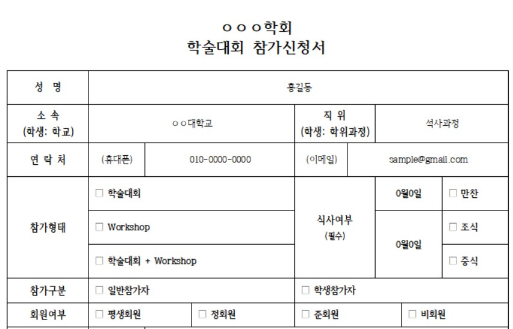

# hwp_to_csv
아래 한글 문서로 작성된 신청서의 내용을 취합하여 dataframe을 생성한 뒤, csv로 저장하는 프로세스

## 1. 패키지 불러오기
별도 설치가 필요한 패키지(olefile)는 설치를 해준다.
```python
pip install olefile
```
각 패키지의 역할은 다음과 같다.
- olefile은 아래 한글 파일을 읽는 역할
- os는 폴더 안에 있는 파일들의 리스트를 읽는 역할
- pandas는 뽑아낸 데이터를 데이터 프레임에 담아 csv 파일로 저장하는 역할
```python
import olefile
import os
import pandas as pd
```
## 2. 한글(hwp) 파일 읽기
olefile로 신청서 한글 파일을 읽어 온다. 
```python
def read_hwp(path): # path = "파일위치/파일.hwp"
    f = olefile.OleFileIO(path)
    # 신청서가 짧은 분량이라 미리보기 뷰로도 충분히 내용을 가져올 수 있음
    encoded_txt = f.openstream("PrvText").read()
    text = encoded_txt.decode("utf-16",errors="ignore")
    return text
```
## 3. text 정제하기
### - 데이터 구조 파악
신청서에서 필요한 내용이 어떻게 text로 저장되었는지 확인한다.

여기서는 필요한 내용들이 표 안에 들어가 있음을 알 수 있다.



### - text에서 표 내용 뽑아내기
PrvText를 통해 가져온 text에서는 표의 셀이 <> 기호로 구분되어 있다.

표 안의 내용엔 띄어쓰기가 중요하지 않음으로 빈칸을 없애고,

text 데이터에서 표의 내용을 다음과 같이 table 리스트로 저장한다.
```python
def text2table(text):
    # 표의 내용만 가져오기 위해 다음과 같이 "><" 기호로 셀을 분리하고,
    # "<" 기호가 있는 경우에만 text데이터를 리스트로 담음
    text = text.replace(" ","").replace("><","\t").replace(">","") 
    text = text.split("\r\n")
    table = [t.replace("<","").split("\t") for t in text if len(t) > 0 and t[0] == "<"]
    return table
```
## 4. 필요한 데이터를 뽑아 리스트에 담기
신청서의 포맷은 동일함으로 table 리스트의 위치에 따라 필요 데이터만 뽑아낸다.
```python
def text2data(table):
    # '성명', '소속', '휴대폰' 등의 데이터 위치를 파악해 해당 내용만 뽑아 저장
    datas = []
    datas.append(table[0][1]) # 홍길동
    datas.append(table[1][1]) # ㅇㅇ대학교
    datas.append(table[2][2]) # 010-0000-0000

    # 같은 row에 포함된 내용들을 한꺼번에 확인
    datas += [""]+[False]*3
    for param in table[3]:

      # □ 기호가 ■ 혹은 ▣ 등으로 바뀌었다면 체크한 것
      if param[0] != "□":
      
        # 만약 이미 데이터가 들어있다면 중복 선택임을 표시할 수 있음
        # if datas[3] != "": 
        #   print("두 가지 이상을 선택함")
        
        # 참가형태는 3가지 중 하나만 선택 가능하기 때문에 우선 빈칸으로 저장하고 
        # 동일한 문자가 왔을 때 입력해주는 방식을 채택함 (선택을 안한 에러가 있을 수 있기 때문)
        if "학술대회+Workshop" in param:
          datas[3]="학술대회+Workshop"
        elif "학술대회" in param:
          datas[3]="학술대회"
        elif "Workshop" in param:
          datas[3]="Workshop"
        
        # 식사의 경우는 각각 만찬, 조식, 중식을 체크하거나 안할 수 있음으로 3가지로 나누어 TF로 저장함
        elif "만찬" in param: # 동일 문자가 포함된 경우 각 문자가 의미하는 위치에 True로 저장
          datas[4]=True
        elif "조식" in param:
          datas[5]=True
        elif "중식" in param:
          datas[6]=True    
    return datas 
```
## 5. 모든 문서에 대하여 데이터를 담아 저장하기
문서 class를 만든 뒤, 모든 문서에 대하여 데이터를 가져올 수 있다.
이후 데이터를 dataframe에 담아 csv 혹은 엑셀로 저장하면 된다.
``` python
class HWPfile():
	def __init__(self,path):
    	self.text = self.read_hwp(path)
        self.table = self.text2table(self.text)
        self.datas = self.text2data(self.table)
    
    def read_hwp(path):
    	# 생략
        return text
    
    def text2table(text):
    	# 생략
        return table
    
    def text2data(table):
    	# 생략
        return datas

# 파일명 리스트
file_list = [name for name in os.listdir('.') if name[-3:]=="hwp"]

# 문서 내 데이터
datas = []
for path in file_list:
  data = HWPfile(path)
  datas.append(data.datas)

# dataframe에 담아 csv 혹은 엑셀로 저장
cols = ['성명', '소속', '휴대폰', '참가형태', '만찬', '조식', '중식']
df = pd.DataFrame(datas, columns=cols)
df.to_csv("sample.csv")
df.to_excel("sample.xlsx")
```

## 느낀점/배운점
- 데이터 파악을 잘한다면 문서 자동화도 쉽게 만들 수 있다!
- hwp 문서의 내용이 길 경우에는 BodyText/Section 읽어 파싱해야한다. [(아래한글 문서 읽기 blog글)](https://code-angie.tistory.com/49)
- 나중에 메일로 들어온 신청서를 자동으로 분류해서 내용을 뽑아낼 수 있도록 작업해보고 싶다.
